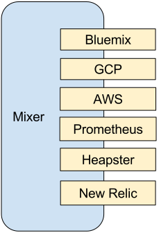

# Mixer

本届解释 Mixer 的角色和总体架构。

## 背景

基础设施后端设计用于提供用于构建服务的支持功能。它们包括访问控制系统，遥测捕获系统，配额执行系统，计费系统等。服务传统上直接与这些后端系统集成，创建一个硬耦合和炙热的(baking-in)特定语义和使用选项。

Mixer在应用程序代码和基础架构后端之间提供通用中介层。它的设计将策略决策从应用层移出并用配置替代，在运维人员控制下。应用程序代码不再将应用程序代码与特定后端集成在一起，而是与Mixer进行相当简单的集成，然后 Mixer 负责与后端系统连接。

混音器**不是**为了在基础设施后端之上创建 _可移植性层_。这不是要试图定义一个通用的日志记录API，通用metric API，通用计费API等等。相反，Mixer旨在改变层之间的界限，以减少系统复杂性，从服务代码中消除策略逻辑，并替代为让运维人员控制。

Mixer 提供三个核心功能：

- **前提条件检查**。允许服务在响应来自服务消费者的传入请求之前验证一些前提条件。前提条件可以包括服务使用者是否被正确认证，是否在服务的白名单上，是否通过ACL检查等等。

- **配额管理**。使服务能够在多个维度上分配和释放配额，配额被用作相对简单的资源管理工具，以便在争取有限的资源时在服务消费者之间提供一些公平性。限速是配额的例子。

- **遥测报告**。使服务能够上报日志和监控。在未来，它还将启用针对服务运营商以及服务消费者的跟踪和计费流。

这些机制的应用是基于一组 [属性](attributes.md)的,这些属性为每个请求物化到 Mixer 中。在Istio内，Envoy重度依赖Mixer。在网格内运行的服务也可以使用Mixer上报遥测或管理配额。（注意：从Istio pre0.2起，只有Envoy可以调用Mixer。）

## 适配器

Mixer 是高度模块化和可扩展的组件。其中一个关键功能是抽象出不同政策和遥测后端系统的细节，允许Envoy和基于Istio的服务与这些后端无关，从而保持他们的可移植。

Mixer在处理不同基础设施后端的灵活性是通过使用通用插件模型实现的。单个的插件被称为*适配器*，它们允许 Mixer 与不同的基础设施后端连接，这些后台可提供核心功能，例如日志，监控，配额，ACL检查等。适配器使Mixer能够暴露一个一致的API，与使用的后端无关。在运行时使用的确切的适配器套件是通过配置确定的，并且可以轻松指向新的或定制的基础设施后端。

## 配置状态

Mixer的核心运行时方法（`Check`, `Report`,和`Quota`）都接受来自输入的一组属性，并在输出上产生一组属性。单个方法执行的工作由输入属性集以及Mixer的当前配置决定。为此，服务运营商负责：

- 配置部署使用的一组*aspects/切面*。切面本质上是配置状态的一个存储块，它配置一个适配器（适配器是如上面所描述的二进制插件）。

- 建立Mixer可以操作的适配器参数类型。这些类型在配置中通过一组*描述符* （如[这里](./mixer-config.md#描述符)所描述的）描述

- 创建规则将每个传入请求的属性映射到特定的一组切面和适配器参数。

需要上述配置状态才能让 Mixer 知道如何处理传入的属性并分发到适当的基础设置后端。

有关 Mixer 配置模型的详细信息，请参阅 [此处](./mixer-config.md)。

## 请求阶段

当一个请求进入Mixer时，它会经历一些不同的处理阶段：

- **Supplementary Attribute Production**. The first thing that happens in Mixer is to run a globally configured
set of adapters that are responsible for introducing new attributes. These attributes are combined with the attributes
from the request to form the total set of attributes for the operation.

- **Resolution**. The second phase is to evaluate the set of attributes to determine the effective 
configuration to apply for the request. See [here](./mixer-config.html#resolution) for information on how resolution works. The effective
configuration determines the set of aspects and descriptors available to handle the request in the
subsequent phases.

- **Attribute Processing**. The third phase takes the total set of attributes
and produces a set of *adapter parameters*. Attribute processing is initially
configured through a simple declarative form as described [here](./mixer-config.html).

- **Adapter Dispatching**. The Resolution phase establishes the set of available aspects and the Attribute
Processing phase creates a set of adapter parameters. The Adapter Dispatching phase invokes the adapters
associated with each aspect and passes them those parameters.

<figure>
<figcaption>Request Phases</figcaption></figure>

## Scripting

> This section is preliminary and subject to change. We're still experimenting with the concept of scripting in Mixer.

Mixer's attribute processing phase is implemented via a scripting language (exact language *TBD*). 
The scripts are provided a set of attributes and are responsible for producing the adapter parameters and dispatching
control to individual configured adapters.

For common uses, the operator authors adapter parameter production rules via a relatively simple declarative format
and expression syntax. Mixer ingests such rules and produces a script that performs the necessary runtime work
of accessing the request's incoming attributes and producing the requisite adapter parameters.

For advanced uses, the operator can bypass the declarative format and author directly in the scripting
language. This is more complex, but provides ultimate flexibility.
