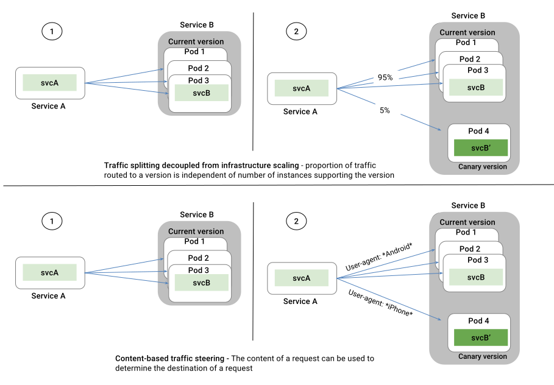

# 概述

本页概述了Istio中流量管理的工作原理，包括流量管理原则的优点。本文假设你已经阅读了 [Istio是什么？](../what-is-istio/overview.md)并熟悉Istio的高级架构。有关单个流量管理功能的更多信息，您可以在本节其他指南中了解。

## Pilot和Envoy

Istio流量管理的核心组件是[Pilot](./pilot.md)，它管理和配置部署在特定Istio服务网格中的所有Envoy代理实例。它允许您指定在Envoy代理之间使用什么样的路由流量规则，并配置故障恢复功能，如超时，重试和熔断器。它还维护了网格中所有服务的规范模型，并使用这个模型，来通过发现服务让Envoy了解网格中的其他实例。

每个Envoy实例维护[负载均衡信息](./balancing.md)，负载均衡信息是基于从Pilot获得的信息，以及其负载均衡池中的其他实例的定期健康检查。从而允许其在目标实例之间智能分配流量，同时遵循其指定的路由规则。

## 流量管理的好处

使用Istio的流量管理模型，本质上解耦流量和基础设施扩展，让运维人员通过Pilot指定他们希望流量遵循什么规则，而不是哪些特定的pod/VM应该接收流量 - Pilot和智能Envoy代理搞定其余的。因此，例如，您可以通过Pilot指定您希望特定服务的5％流量可以转到金丝雀版本，而不考虑金丝雀部署的大小，或根据请求的内容将流量发送到特定版本。

将流量从基础设施扩展中解耦，这样就可以让Istio提供各种流量管理功能，这些功能在应用程序代码之外。除了A/B测试的动态[请求路由](request-routing.md)，逐步推出和金丝雀发布之外，它还使用超时，重试和熔断器处理[故障恢复](handling-failures.md)，最后还可以通过[故障注入](fault-injection.md) 来测试服务之间故障恢复策略的兼容性。这些功能都是通过在服务网格中部署的Envoy sidecar/代理来实现的。
