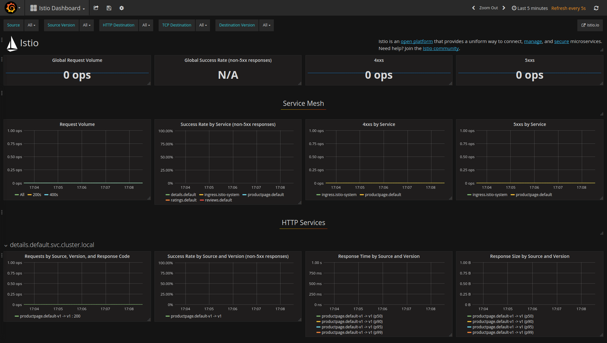

# 使用Grafana可视化Metrics

这个任务展示了如何设置和使用Istio Dashboard对Service Mesh中的流量进行监控。作为这个任务的一部分，需要安装Grafana的Istio插件，然后使用Web界面来查看Service Mesh的流量数据。

## 开始之前

- 在集群上[安装Istio](../../setup/)并部署一个应用。

- 安装Prometheus插件。

    ```bash
    kubectl apply -f install/kubernetes/addons/prometheus.yaml
    ```

	Istio Dashboard必须有Prometheus插件才能工作。

## 查看Istio Dashboard

1. 要在Dashboard上查看Istio的Metrics，首先要安装Grafana。

	在Kubernetes环境下，执行下面的命令：

    ```bash
    kubectl apply -f install/kubernetes/addons/grafana.yaml
    ```

2. 验证服务运行在集群中。

	在Kubernetes环境下，执行下面的命令：

    ```bash
    kubectl -n istio-system get svc grafana
    ```

	输出类似：

    ```bash
    NAME      CLUSTER-IP      EXTERNAL-IP   PORT(S)    AGE
    grafana   10.59.247.103   <none>        3000/TCP   2m
    ```

3. 通过Grafana界面，打开Istio的Dashboard

	在Kubernetes环境中，执行下面的命令：

    ```bash
    kubectl -n istio-system port-forward $(kubectl -n istio-system get pod -l app=grafana -o jsonpath='{.items[0].metadata.name}') 3000:3000 &
    ```

	然后使用浏览器访问[http://localhost:3000/dashboard/db/istio-dashboard](http://localhost:3000/dashboard/db/istio-dashboard)：

	Istio Dashboard大概是这样的：

	

1. 向Mesh发起流量。

	对于BookInfo示例，使用浏览器打开`http://$GATEWAY_URL/productpage`，或者发出下列命令：

   ```bash
   curl http://$GATEWAY_URL/productpage
   ```

	刷新几次浏览器(或者发送几次命令)，以产生少量流量：

	再次打开Istio Dashboard，它会反应刚生成的流量。看上去类似这样：

	

	注意：`$GATEWAY_URL`的值是在[BookInfo](../../guides/bookinfo.md)指南中设置的。

## 关于Grafana插件

Grafana插件是一个预先配置好的Grafana实例。我们修改了基础镜像([`grafana/grafana:4.1.2`](https://hub.docker.com/r/grafana/grafana/))，在其中加入了Prometheus数据源，以及安装了Istio Dashboard。Istio和Mixer的初始安装中就会初始化一个缺省的（对所有服务生效的）全局Metrics。Istio Dashboard就是依赖这一默认Istio metrics配置和Prometheus插件来完成工作的。

Istio Dashboard由三个部分组成：

1. 全局汇总视图：在Service Mesh中发生的HTTP请求流量的汇总。

2. Mesh汇总视图：比全局汇总视图详细一些，可以根据服务进行过滤和选择。

3. 单一服务视图：提供了单一服务视角下，在Service Mesh内部（HTTP和TCP）请求和响应的情况。

[Grafana官方文档](http://docs.grafana.org/)介绍了更多关于创建、配置和编辑Dashboard的内容。

## 清理

* 在Kubernetes环境中，执行下面的命令可以移除Grafana插件。

    ```bash
    kubectl delete -f install/kubernetes/addons/grafana.yaml
    ```

* 删除所有可能在运行的的`kubectl port-forward`进程：

    ```bash
    killall kubectl
    ```

* 如果不想继续后续内容，参考[BookInfo清理](../../guides/bookinfo.md#清理)的介绍来关闭应用。
